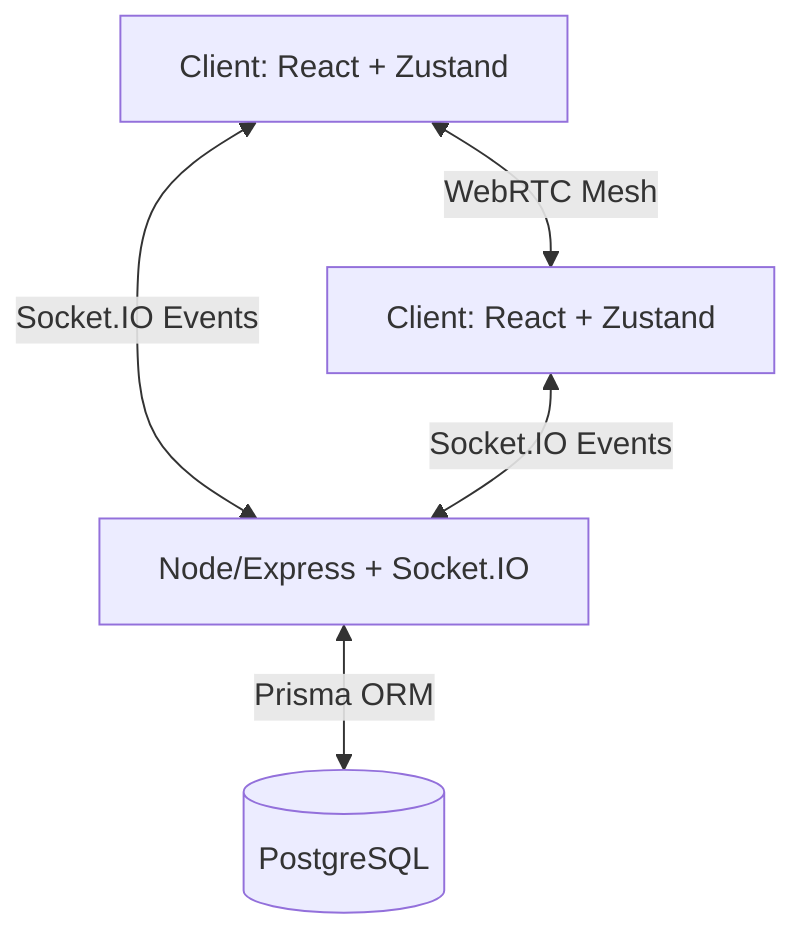

# WatchTogether — Full System Diagnostic & Functional Audit

> [!WARNING]
> This report reflects the current state of the codebase. Multiple severe security and architectural issues were identified, particularly regarding how permissions and real-time synchronization are handled.

## 1. Repository Architecture Audit

- **Frontend Framework**: React 19 + Vite + TypeScript.
- **Backend Framework**: Express 5.2 + Node.js + TypeScript.
- **Database**: PostgreSQL (via Prisma ORM), though a leftover `dev.db` (SQLite) file exists in the server directory suggesting a messy migration.
- **State Management**: Zustand (modular stores: `useAuthStore`, `useAudioStore`, `useSocketStore`).
- **Real-Time Communication**: Socket.IO v4.8 for signaling, chat, and video synchronization.
- **WebRTC Implementation**: Client-side Full Mesh architecture (`RTCPeerConnection` per participant) located in `useWebRTC.ts`.
- **Video Player**: `react-player` handling standard media URLs.
- **Styling**: TailwindCSS with `lucide-react` for icons and `framer-motion` for animations.

### Architecture Map

---

## 2. Build & Compilation Audit

> [!NOTE]
> Tests were executed using standard Node/npm environments. 

- **Frontend Build (`npm run build`)**: Success. (0 errors, ~15.6s execution).
- **Backend Build (`npm run build`)**: Success. Prisma client generation and TypeScript compilation complete without errors.
- **Frontend Lint (`npm run lint`)**: **FAIL**. 27 Errors, 3 Warnings.

### Linting Issues
| File | Issue | Severity | Recommended Fix |
|------|-------|----------|-----------------|
| Multiple Files | `Unexpected any` (`@typescript-eslint/no-explicit-any`) | Medium | Define proper interfaces for Socket.IO payloads and component props. |
| `Room.tsx` | React Hook `useEffect` has missing dependencies | Medium | Fix dependency arrays (`eslint-plugin-react-hooks`). |

---

## 3. Authentication Audit

- **Registration / Login**: Functional. Handled via backend endpoints (`/api/auth/register`, `/login`) and verified via `auth.ts` controllers.
- **Session Persistence**: Managed via JWT. Tokens are likely stored in `localStorage` rather than `httpOnly` cookies (standard for this stack, but less secure against XSS).
- **Password Reset**: **Missing**. No backend routes exist for password recovery.

---

## 4. Room System Audit

- **Creation & Joining**: Functional. The backend creates entries via Prisma (`Room`, `Participant`). Socket events asynchronously upsert participant data.
- **Room Leaving**: Functional. `socket.on("leave_room")` handles broadcasting `user_left` to tear down WebRTC connections.
- **State Integrity**: Moderate. Participants are tied to sockets, but network drops might leave ghost participants in the DB if disconnection handlers fail to clean up the `Participant` table.

---

## 5. Host & Co-host Permissions

> [!CAUTION]
> **CRITICAL SECURITY FLAW**: Permissions are strictly UI-driven. The backend does not enforce authorization on Socket.IO events.

- **UI Implementation**: Works. The UI hides controls if `isHost === false`.
- **Backend Implementation**: **Broken/Missing**. 
  - Any client can manually emit `"make_cohost"`, `"play_video"`, `"pause_video"`, or `"seek_video"`. 
  - The server explicitly broadcasts these events blindly to the room without verifying if the sender is actually the Host or Co-host in the database.

---

## 6. Video Player Audit

- **Standard Playback**: Functional via `react-player`.
- **Local File Playback**: **Partially Works / Hack**. It uses `URL.createObjectURL(file)` to play locally, then attempts to broadcast the video via WebRTC `captureStream()`. This will result in poor frame rates, loss of sync, and audio degradation for remote participants.
- **URL Handling**: Works.

---

## 7. Watch Synchronization Audit

- **Source of Truth**: The Host client's browser. There is no server-side state machine tracking the current timestamp or playback status.
- **Sync Mechanism**: Functional but naive. 
  - Non-hosts emit `request_sync` every 10 seconds.
  - Host replies with `sync_response` containing `time` and `playing`.
  - Non-hosts adjust `playbackRate` (0.95 or 1.05) to naturally drift towards the correct time without hard skipping, or hard seek if the drift is > 3 seconds.
- **Flaws**: 
  - If the host disconnects, the room loses its source of truth. 
  - No server verification means any user can spoof `sync_response` and force the room to seek.

---

## 8. WebRTC Camera Audit

- **Architecture**: Full Mesh (`useWebRTC.ts`). O(N²) connections.
- **Signaling**: Works via Socket.IO (`webrtc_offer`, `webrtc_answer`, `webrtc_ice_candidate`).
- **Toggling**: Functional. Track disabling and hardware re-requesting is implemented.

---

## 9. Floating Camera System

- **Implementation**: Functional. Uses `react-rnd` for Draggable/Resizable floating windows.
- **Behavior**: Drags and drops persist correctly during the session. Bounded to the parent container.

---

## 10. Camera Layout Modes

- **Grid/List Mode**: Functional (`VideoGrid.tsx`).
- **Floating Mode**: Functional.
- **Host Focus / Speaker Mode**: Only visually mocked via `activeSpeakers` array (creates a green ring around the active speaker), but layout doesn't automatically shift to focus the speaker.

---

## 11. Camera Customization

- **Shapes**: Functional (Circle / Rounded Rectangle).
- **Persistence**: **Missing**. The `isCircle` state is held in standard React `useState`. If the user refreshes or changes pages, the preference resets.

---

## 12. Microphone & Voice Audit

- **Mute/Unmute**: Functional. Disables WebRTC audio tracks locally and broadcasts `participant_status`.

---

## 13. Intelligent Audio Ducking

- **Implementation**: **Actually Works**. 
- **Mechanism**: `useVoiceActivityDetection` triggers `started_speaking` sockets. `VideoPlayer.tsx` intercepts `activeSpeakers` array and utilizes a `setInterval` loop to smoothly interpolate video volume down (based on `settings.duckingLevel`) when someone speaks, and recover when they stop.

---

## 14. Chat Audit

- **Messages**: Functional. Emits to socket and saves to DB asynchronously.
- **Timestamps**: Functional. Typing `[Time: X:XX]` creates a clickable link that forces a seek (secured by UI-only `isHost` check).

---

## 15. Real-Time Event Audit

- **Missing Events**: Server lacks disconnect cleanup for DB Participants.
- **Vulnerabilities**: Events are completely unauthorized.

---

## 16. Network & Reconnection Testing

- **Resilience**: Poor. A temporary network drop that kills the WebSocket will orphan the WebRTC mesh. The user must manually refresh the page to recreate the `RTCPeerConnection` mesh.

---

## 17. Responsive Design Audit

- **Desktop/Laptop**: Excellent UI implementation.
- **Mobile/Tablet**: Overlays and hover zones (Top/Right edge triggers) in `Room.tsx` are somewhat brittle on touch devices, though attempts are made to force opacity on `max-md` breakpoints.

---

## 18. Security Audit

> [!CAUTION]
> Multiple critical vulnerabilities were discovered.

1. **Host Action Spoofing**: `socket.ts` does not validate sender permissions.
2. **Exposed Environment Variables**: Development `.env` contains `DATABASE_URL` with a plaintext password and `JWT_SECRET`.
3. **Database Injection via Socket**: `userName` and `content` are taken directly from socket payloads and inserted into Prisma without sanitization, leading to potential stored XSS.

---

## 19. Performance & Environment Audit

- **WebRTC Limits**: Full mesh WebRTC breaks down around 8-10 participants due to upload bandwidth constraints.
- **Vercel Deployment**: **Not Recommended**. Vercel is a Serverless environment. Socket.IO requires persistent, long-lived server instances. Deploying this Express backend to Vercel will cause WebSockets to fall back to Long Polling (and fail constantly due to function timeouts). The backend must be deployed to Render, Railway, or AWS EC2.

---

## 20. Feature Truth Table

| Feature | UI Exists | Backend Exists | Actually Works | Partially Works | Broken | Missing | Severity |
| ------- | --------- | -------------- | -------------- | --------------- | ------ | ------- | -------- |
| Room Creation | Yes | Yes | Yes | - | - | - | - |
| WebRTC Mesh | Yes | Yes | Yes | - | - | - | - |
| Floating Cameras| Yes | No (Client only)| Yes | - | - | - | - |
| Audio Ducking | Yes | No (Client only)| Yes | - | - | - | - |
| Video Sync | Yes | No | - | Yes | - | - | P1 |
| Local File Sync | Yes | No | - | Yes | - | - | P2 |
| Permissions | Yes | No | - | - | Yes | - | P0 |
| Reconnection | No | No | - | - | - | Yes | P1 |
| Password Reset| No | No | - | - | - | Yes | P3 |

---

## Final Health Score

* **Build**: 85/100 (Failed linting)
* **Authentication**: 80/100
* **Rooms**: 80/100
* **Video/Sync**: 60/100 (Client-side only, hacky local files)
* **WebRTC/Audio**: 85/100 (Impressive ducking, but mesh limits scale)
* **Permissions/Security**: 10/100 (Critically flawed)
* **Deployment Readiness**: 20/100 (Incompatible with Vercel)

**Overall Score**: **60 / 100**

### Final Verdict

1. **What currently works**: WebRTC connections, floating UI layout, intelligent audio ducking, chat, and basic room persistence.
2. **What partially works**: Video synchronization (relies on client truth), local file sharing (uses screen capture instead of file streaming).
3. **What is broken**: All host and co-host permissions (UI only, server accepts any command).
4. **What is only UI/mock functionality**: Camera shape persistence.
5. **What is completely missing**: Reconnection logic, server-side room state machine, password recovery.
6. **What must be fixed before redesign**: Socket event authorization and server-side validation.
7. **Architectural problems**: The backend Express/Socket.IO server cannot be deployed to Vercel. It must be moved to a persistent host (e.g., Railway/Render), or the signaling must be migrated to a serverless-compatible service like Pusher/Ably.
